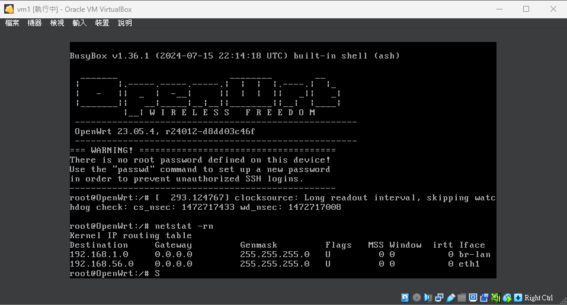
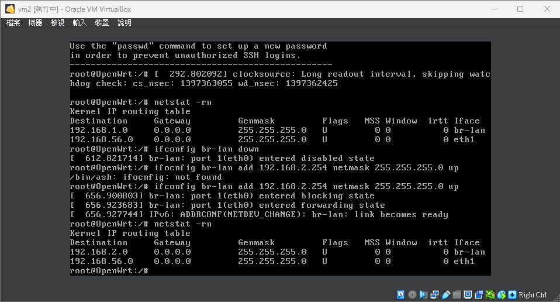
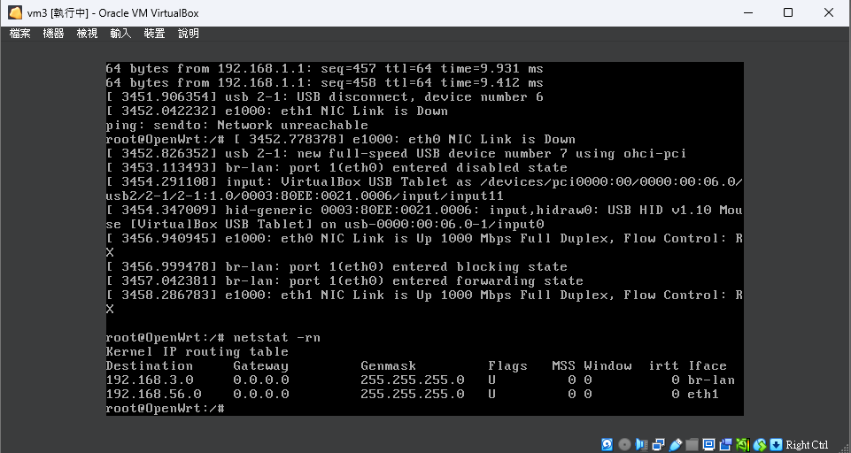
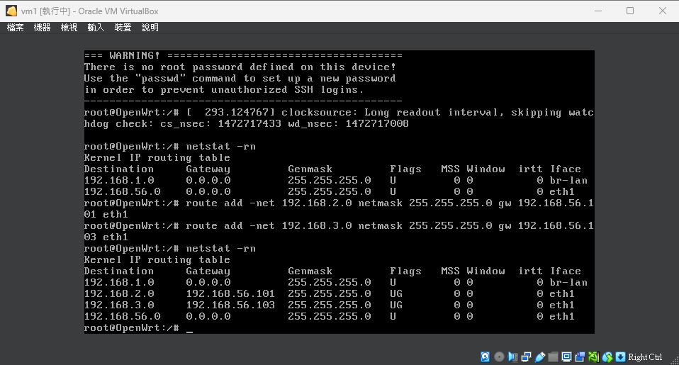
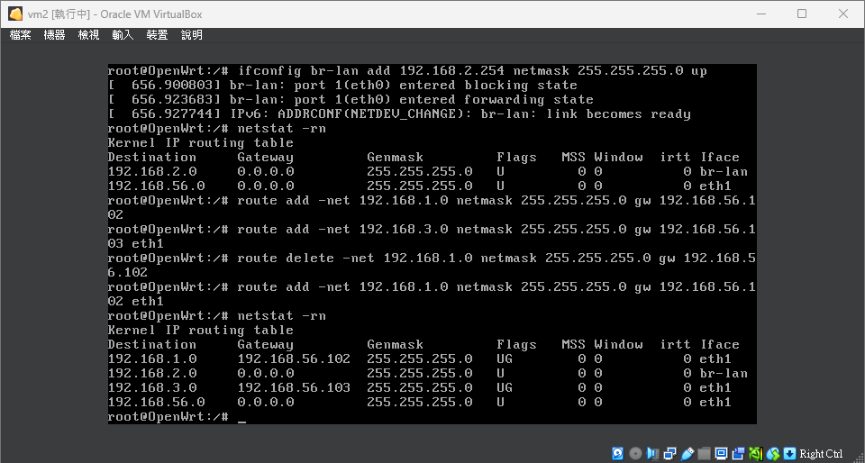
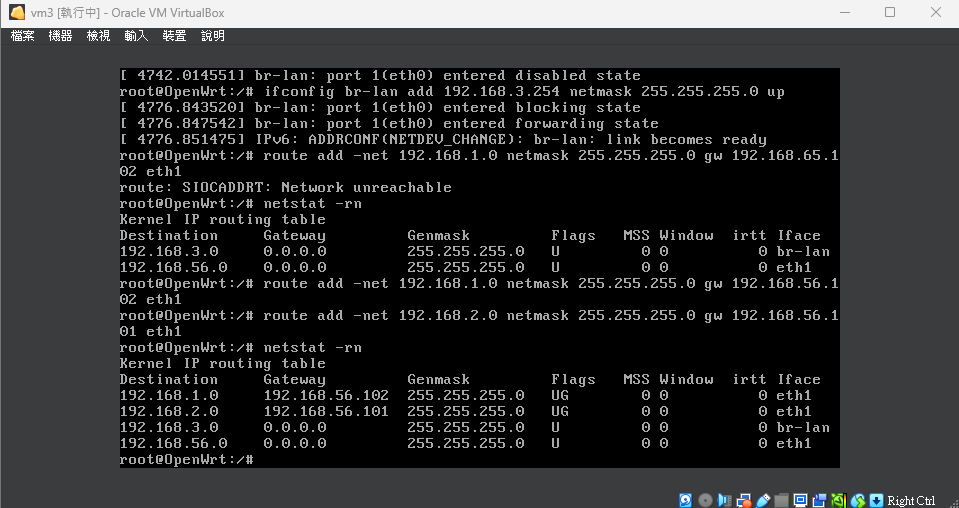
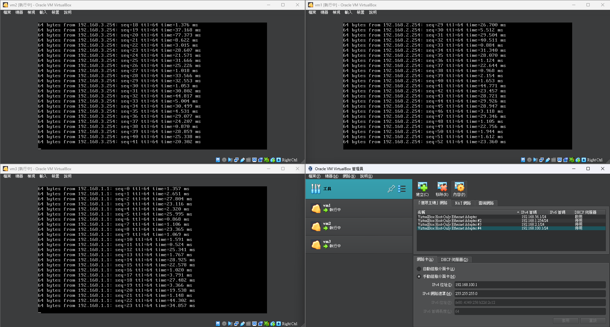

# 路由器建立步驟

## 過程原理

- 設定 IP 路由：`192.168.1.0 -> 192.168.56.0 -> 192.168.2.0`

## 前置準備

1. **建立資料夾**：建立 `vm1` 和 `vm2` 資料夾。
2. **確認 VirtualBox 工具**：確認已安裝 VirtualBox，若未安裝，請至官網下載安裝。
3. **下載 OpenWRT**：
   - 選擇日本的 HTTP 鏈接。
   - 進入 `target -> X86 -> generic` 路徑。
   - 下載 `generic-ext4-combined-efi.img.gz` 檔案。
   - 解壓縮檔案，若遇到錯誤訊息，可以忽略。

4. **準備映像檔**：
   - 將解壓縮後的 `openwrt-23.05.4-x86-generic-generic-ext4-combined-efi.img` 複製到 `vm1` 和 `vm2` 資料夾中。
   - 更改檔案名稱：
     - 將 `openwrt-23.05.4-x86-generic-generic-ext4-combined-efi.img` 改名為 `vm1.img` (放在 `vm1` 資料夾)。
     - 將 `openwrt-23.05.4-x86-generic-generic-ext4-combined-efi.img` 改名為 `vm2.img` (放在 `vm2` 資料夾)。

## 建立 VirtualBox 虛擬磁碟檔 (VDI)

1. 打開命令提示字元 (CMD)，進入 `vm1` 資料夾：

   ```bash
   cd C:\Users\xiang0105\Desktop\Downloads\virtual machine\vm1
   ```

2. 執行 VBoxManage 指令來轉換磁碟格式：

   ```bash
   "C:\Program Files\Oracle\VirtualBox\VBoxManage.exe" convertdd vm1.img vm1.vdi
   ```

## 建立 VirtualBox 本機網卡

1. 開啟 VirtualBox 的「工具」->「網路」。
2. 建立兩個本機僅限網卡：
   - **網卡 #2**：
     - 建立後，點擊「內容」。
     - 手動設定 IPv4 地址為 `192.168.1.254`。
   - **網卡 #3**：
     - 建立後，點擊「內容」。
     - 手動設定 IPv4 地址為 `192.168.1.2`。

## 建立 vm1 虛擬機

1. 在 VirtualBox 中點擊「歡迎」->「新增」：
   - 名稱：`vm1`
   - 資料夾：`vm1` 資料夾的絕對路徑
   - 類型：`Linux`
   - 版本：`Other Linux (32-bit)`
      >如果你前面選的是64位元這邊也請選擇64位元
2. 點選「虛擬磁碟」，選擇 `vm1.vdi`。
3. 完成後，開啟設定：
   - 網路設定：
     - **介面卡1**：選擇「僅限本機」，並選擇 #2 的介面卡。
     - **介面卡2**：啟用並選擇 #3 的介面卡。
4. 設定完成後，啟動 `vm1`，執行 `ifconfig` 測試網路。

## 建立 vm2 虛擬機

1. 在 CMD 中輸入以下指令來更改 `vm2.vdi` 的 UUID：

   ```bash
   cd C:\Users\xiang0105\Desktop\Downloads\virtual machine\vm2
   "C:\Program Files\Oracle\VirtualBox\VBoxManage.exe" internalcommands sethduuid vm2.vdi
   ```

2. 使用與建立 `vm1` 相同的步驟來建立 `vm2` 虛擬機。
3. 點選「虛擬磁碟」，選擇 `vm2.vdi`。
4. 完成後，開啟設定：
   - 網路設定：
     - **介面卡1**：選擇「僅限本機」，並選擇 #3 的介面卡。
     - **介面卡2**：啟用並選擇 無# 的介面卡。
5. 啟動 `vm2` 虛擬機後，輸入以下指令設定網卡：

   ```bash
   ifconfig br-lan down
   ifconfig br-lan add 192.168.2.254 netmask 255.255.255.0 up
   ```

## 建立 vm3 虛擬機

1. 在 CMD 中輸入以下指令來更改 `vm3.vdi` 的 UUID：

   ```bash
   cd C:\Users\xiang0105\Desktop\Downloads\virtual machine\vm3
   "C:\Program Files\Oracle\VirtualBox\VBoxManage.exe" internalcommands sethduuid vm3.vdi
   ```

2. 使用與建立 `vm1` 相同的步驟來建立 `vm3` 虛擬機，但要新增一個網卡#4(192.168.100.1)。
3. 點選「虛擬磁碟」，選擇 `vm3.vdi`。
4. 完成後，開啟設定：
   - 網路設定：
     - **介面卡1**：選擇「僅限本機」，並選擇 #4 的介面卡。
     - **介面卡2**：啟用並選擇 無# 的介面卡。
5. 啟動 `vm2` 虛擬機後，輸入以下指令設定網卡：

   ```bash
   ifconfig br-lan down
   ifconfig br-lan add 192.168.3.254 netmask 255.255.255.0 up
   ```

## 檢查及測試

- 啟動虛擬機後使用 `ifconfig` 確認網路是否正確設定。
- 開啟chorme輸入168.192.1.1看使否可以進入後端。
- 開啟chorme輸入168.192.2.1看使否可以進入後端。
- 開啟chorme輸入168.192.3.1看使否可以進入後端。

## VM 透過相同網卡傳遞封包

### 問題描述

需要實現 VM1 與 VM2、VM3 間的連接，使得以下網絡能夠互相通信：

- VM1: `192.168.1.1`
- VM2: `192.168.2.1`
- VM3: `192.168.3.1`

一開始 VM1 無法 Ping 通 VM2 和 VM3，需要透過配置共同的網卡進行傳輸。

---

### 網絡配置概覽

#### 虛擬機及網卡資訊

| 虛擬機 | 網卡1 (內部網絡) | 網卡2 (橋接網絡) | 網路地址1      | 網路地址2      |
|--------|-------------------|-------------------|----------------|----------------|
| VM1    | 192.168.1.254    | 192.168.56.1     | 192.168.1.0    | 192.168.56.102 |
| VM2    | 192.168.2.254    | 192.168.56.1     | 192.168.2.0    | 192.168.56.101 |
| VM3    | 192.168.3.254    | 192.168.56.1     | 192.168.3.0    | 192.168.56.103 |

---

### 檢測畫面

使用以下指令得到相對應的資訊

``` bash
   netstat -rn
```





如果沒有像是上面那些圖片的結果，你可能需要先檢測以下指令使否已經輸入
(192.168.X.254 -> 192.168.X.0)

```bash
   ifconfig br-lan down
   ifconfig br-lan add 192.168.X.254 netmask 255.255.255.0 up
   ```

### 配置步驟

#### 1. 增加路由

##### 在 VM1 中

使用以下指令配置到 VM2 和 VM3 的路由：

```bash

# 添加到 VM2 的路由
route add -net 192.168.2.0 netmask 255.255.255.0 gw 192.168.56.101 eth1

# 添加到 VM3 的路由
route add -net 192.168.3.0 netmask 255.255.255.0 gw 192.168.56.103 eth1

```



```bash

# 添加到 VM1 的路由
route add -net 192.168.1.0 netmask 255.255.255.0 gw 192.168.56.102 eth1

# 添加到 VM3 的路由
route add -net 192.168.3.0 netmask 255.255.255.0 gw 192.168.56.103 eth1

```



```bash

# 添加到 VM1 的路由
route add -net 192.168.1.0 netmask 255.255.255.0 gw 192.168.56.102 eth1

# 添加到 VM2 的路由
route add -net 192.168.2.0 netmask 255.255.255.0 gw 192.168.56.101 eth1

```



## 測試與 VM1 的連接

在vm2,vm3輸入 ping 192.168.1.254

## 測試與 VM2 的連接

在vm1,vm3輸入 ping 192.168.2.254

## 測試與 VM3 的連接

在vm1,vm2輸入 ping 192.168.3.254



## 常見錯誤與解決方法

1. 程式碼拼錯

   - 在編寫指令或配置時，經常出現拼寫錯誤，導致無法執行正確的操作。

2. 環境建置失敗

   - 錯誤配置網絡指令，導致環境無法正常運作，例如以下指令：
  
     ```bash
     ifconfig br-lan add 192.168.X.254 netmask 255.255.255.0 up
      ```

3. Ping 錯目標路徑

   - 在測試連接時，輸入錯誤的目標 IP，導致 Ping 測試無法成功。
