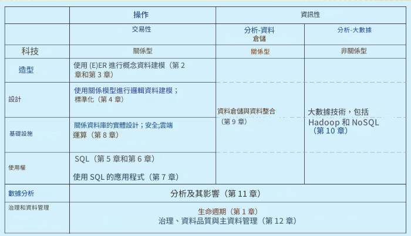
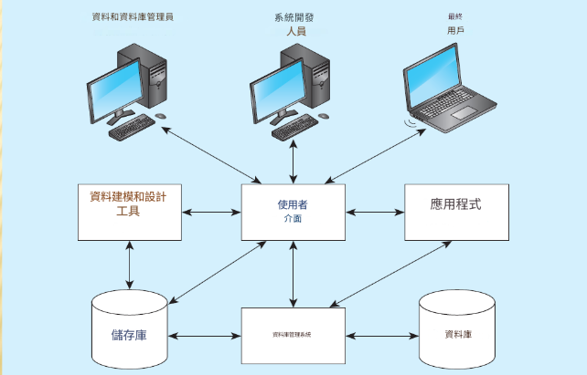
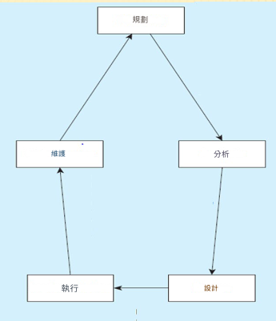
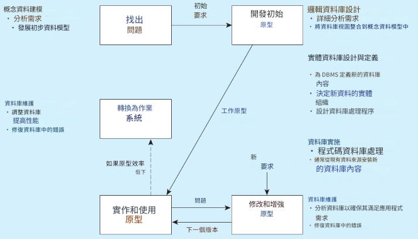
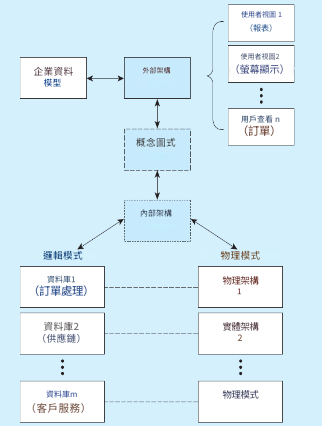

# The Database Environment and Development Process

## 資料庫環境和開發流程

## 目錄

[1.1 Define terms](#11-define-terms)
[1.2 Name limitations of conventional file processing](#12-name-limitations-of-conventional-file-processing)
[1.3 Explain advantages of databases](#13-explain-advantages-of-databases)
[1.4 Identify costs and risks of databases](#14-identify-costs-and-risks-of-databases)
[1.5 Distinguish between operational and informational data management](#15-distinguish-between-operational-and-informational-data-management)
[1.6 List components of database environment](#16-list-components-of-database-environment)
[1.7 Identify categories of database applications](#17-identify-categories-of-database-applications)
[1.8 Explain prototyping and agile development approaches](#18-explain-prototyping-and-agile-development-approaches)
[1.9 Explain roles of individuals](#19-explain-roles-of-individuals)
[1.10 Explain differences between personal, multi-tiered,and enterprise data management](#110-explain-differences-between-personal-multi-tieredand-enterprise-data-management)
[1.11 Explain three-schema architectures (external,conceptual, internal)](#111-explain-three-schema-architectures-externalconceptual-internal)

## 1.1 Define terms

### 定義術語

#### Definitions(定義)

1. Database(資料庫)
    * 有組織的集合
2. Data(資料)
    * 儲存有意義的物件的表示和事件
    * 結構化：數字、文字、日期
      > 也就是經過整理後的資訊
    * 非結構化：影像、影片、文檔
      > 也就是尚未整理 難獲取的資料
3. Information(資訊)
    * 經處理後的數據
4. Metadata(元資料)
    * date about date 也就是資料中的資料

#### Disadvantages Of File Processing(文件處理的缺點)

1. 程序-所有程式都維護它們所使用的每個檔案的元數據
2. 資料重複-不同的系統/程序有單獨的副本相同的數據
3. 有限的數據共享-資料無集中控制
4. 漫長的開發時間-程式設計師必須設計自己的文件格式
5. 過多的程序維護-資訊系統預算的80%

[回目錄](#目錄)

---

## 1.2 Name limitations of conventional file processing

### 傳統文件處理的名稱限制

1. Data models(資料模型)
   * 捕捉資料性質與關係的圖表
   * 企業資料模型–高層實體與關係組織
   * 專案資料模型–更詳細的視圖，符合資料結構資料庫或資料倉儲
2. Entities(實體)
   * 描述人、地點、物件、事件或概念的名詞形式
   * 由屬性組成
3. Relationships(關係)
   * 通常是一對多 (1:N) 或多對多 (M:N)，但也可以是一對一 (1:1)

[回目錄](#目錄)

---

## 1.3 Explain advantages of databases

### 解釋資料庫的優點

#### 資料庫方法的優點

1. 程序資料獨立性(independence)
2. 計劃的數據冗餘(redundancy)
3. 提高資料一致性(consistency)
4. 改進的數據共享(sharing)
5. 提高應用程式開發效率(development productivity)
6. 標準的執行(Enforcement of standards)
7. 提高數據品質(quality)
8. 提高資料可存取性和回應能力(accessibility and responsiveness)
9. 減少程序維護(Reduced program maintenance)
10. 改進的決策支持(Improved decision support)

[回目錄](#目錄)

---

## 1.4 Identify costs and risks of databases

### 識別資料庫的成本和風險

#### 資料庫方法的成本和風險

1. 新的專業人才
2. 安裝和管理成本和複雜性
3. 轉換成本
4. 需要明確備份和復原
5. 組織衝突

[回目錄](#目錄)

---

## 1.5 Distinguish between operational and informational data management

### 區分營運資料管理和資訊資料管理

[回目錄](#目錄)

---

## 1.6 List components of database environment

### 列出資料庫環境的元件

#### 資料庫環境的組成

1. 資料建模和設計工具－用於設計的自動化工具資料庫和應用程式
2. 儲存庫–元資料的集中倉庫
3. 資料庫管理系統(DBMS)–用於管理的軟體資料庫
4. 資料庫－資料的倉庫
5. 應用程式–使用資料的軟體
6. 使用者介面–供使用者使用的文字、圖形顯示、選單等
7. 資料/資料庫管理員–負責以下工作的人員維護資料庫
8. 系統開發人員–負責設計的人員資料庫和軟體
9. 最終使用者–使用應用程式和資料庫的人

[回目錄](#目錄)

---

## 1.7 Identify categories of database applications

### 識別資料庫應用程式的類別

#### 資料庫開發流程

1. SDLC(系統發展生命周期)
   * 系統開發生命週期
   * 詳細、精心策劃的開發流程
   * 耗時但全面
   * 開發週期長
2. 原型設計
   * 快速應用開發(RAD)
   * 概念資料建模的粗略嘗試
   * 在初始原型開發期間定義資料庫
   * 重複實施與維護活動新的原型版本

>SDLC是一種幫助開發人員以最低成本和盡可能快的速度規劃、創建、測試和部署高品質軟體產品的方法
>RAD可以輕鬆地連接多種不同的資料庫，並進行資料操作和管理

[回目錄](#目錄)

---

## 1.8 Explain prototyping and agile development approaches

### 解釋原型設計和敏捷開發方法

#### 系統開發生命週期 (SDLC)

* 用於開發、維護和替換的傳統方法資訊系統
* 五個主要步驟：
  1. 規劃－初步了解業務狀況。企業模型和概念資料建模。
  2. 分析－對業務狀況進行徹底分析，得出功能要求。詳細的概念資料建模。
  3. 設計－邏輯與實體資料庫設計、開發技術和組織。
  4. 實作－編寫程式、建立資料庫、測試、安裝、培訓和記錄。
  5. 維護－監控、修復和增強

#### 替代資訊系統開發方法

1. 傳統的SDLC:有條理、有結構且耗時
2. 快速應用程式開發(RAD):更快、更多自適應，尤其是當資料庫已經就位時
3. 多種口味：
    * 原型設計
    * 敏捷方法論
    * 極限編程
    * Scrum
    * DSDM(動態系統開發方法)

[回目錄](#目錄)

---

## 1.9 Explain roles of individuals

### 解釋個人的角色

[回目錄](#目錄)

---

## 1.10 Explain differences between personal, multi-tiered,and enterprise data management

### 解釋個人、多層和企業資料管理之間的差異

[回目錄](#目錄)

---

## 1.11 Explain three-schema architectures (external,conceptual, internal)

### 解釋三種模式架構(外部、概念、內部)

#### 三模式架構

1. 不同的人有不同的看法資料庫的
2. 外部架構
      * 使用者瀏覽量
      * 概念圖式的子集
      * 可以從業務中確定-函數/資料實體矩陣
      * DBA 確定模式不同的用戶
3. 概念模式(ER模型)
4. 內部架構(邏輯與物理結構)

#### 管理參與資料庫開發的人員

1. 項目－相關項目的計畫實施為達到某個目標而進行的活開始和結束
2. 在SDLC規劃階段發起並策劃
3. 在分析、設計與實施過程中執行執行
4. 實施結束時關閉

#### 資料庫專案團隊成員(2 位中的 1 位)

1. 業務分析師–分析業務狀況並建立要求
2. 系統分析師–與業務分析師類似，但也有整體資訊系統的技術專長
3. 資料庫分析師與資料建模師–分析師專注於資料庫
4. 使用者－「客戶」將他們的需求傳達給分析師
5. 程式設計師－與互動相關的程式的編碼者資料庫

#### 資料庫專案團隊成員 (2 OF 2)

1. 資料庫架構師–建立資料標準業務單位
2. 資料管理員–負責現有資料庫，確保資料完整性和一致性
3. 專案經理–監督專案、管理項目人員
4. 其他技術專家–網路、作業系統、文件等

#### 資料庫系統的演變

* 由四個主要目標驅動：
  1. 需要程式資料獨立性，以便減少維護
  2. 希望管理更複雜的資料型別和結構
  3. 技術人員較少的情況下也能輕鬆存取數據
  4. 需要更強大的決策支持平台

<!-- 圖 1-11 資料庫技術的範圍：過去
並呈現(4 中的 1)
(a) 資料庫技術的演變
(b) 資料庫架構
(b) 資料庫架構
(b) 資料庫架構 -->

#### 資料庫應用程式的範圍

1. 個人資料庫
2. 典型大小(以兆位元組為單位)
3. 供一名使用者使用
4. 部門多層客戶端/伺服器資料庫
5. 典型大小(以GB為單位)
6. 面向多個用戶，通常不超過100個部門寬的
7. 企業應用
8. 典型大小以千兆位元組、太字節甚至拍位元組為單位
9. 面向整個公司範圍的龐大用戶群

#### 資料庫結構定義

##### 企業應用程式的類型

* 企業系統(通常涉及關聯式資料庫)
  1. 組織的支柱
  2. 企業資源規劃(ERP)
  3. 客戶關係管理
  4. 供應鏈管理
  5. 人力資源管理與薪資管理
* 資料倉儲(通常涉及關聯式資料庫)
  1. 整合多個資料來源的數據
  2. 維護歷史數據
  3. 幫助識別模式和趨勢
  4. 資料湖(通常不涉及關聯式資料庫)
  5. 內部和外部資料的大型整合儲存庫不遵循預先定義的模式

<!-- 圖 1-13 執行儀表板範例
(http://public.tableausoftware.com/profile/mirandali#!/vizhome/Executive-
Dashboard_7/ExecutiveDashboard)由 Tableau Software 提供 -->

<!-- >松谷家具 (PVF)
     1. PVF 是一家虛構的家具公司
     2. 將作為案例貫穿全書
     3. 第 1 章主題包括
     4. Pine Valley Furniture Company 的資料庫演變
     5. 專案企劃
     6. 分析資料庫需求
     7. 資料庫設計
     8. 使用資料庫
     9. 管理資料庫
     10. PVF資料庫的未來 -->

[回目錄](#目錄)
