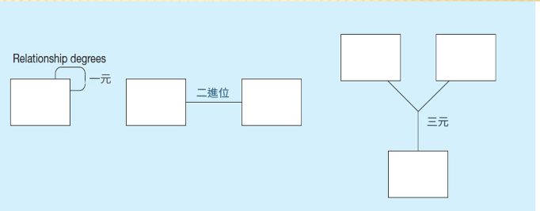
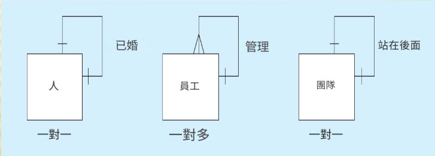

# Modeling Data in the Organization

## 組織中的資料建模

## 目錄

[2.1 Define terms](#21-define-terms)
[2.2 Understand importance of data modeling](#22-understand-importance-of-data-modeling)
[2.3 Write good names and definitions for entities, relationships, and attributes](#23-write-good-names-and-definitions-for-entities-relationships-and-attributes)
[2.4 Distinguish unary, binary, and ternary relationships](#24-distinguish-unary-binary-and-ternary-relationships)
[2.5 Model different types of attributes, entities, relationships, and cardinalities](#25-model-different-types-of-attributes-entities-relationships-and-cardinalities)
[2.6 Convert many-to-many relationships to associative entities](#26-convert-many-to-many-relationships-to-associative-entities)
[2.7 Model time-dependent data using time stamps](#27-model-time-dependent-data-using-time-stamps)

## 2.1 Define terms

### 術語定義

#### E-R模型構造

1. 實體：
   * 實體實例 – 人、地點、物體、事件、概念（通常對應於表中的一行）
   * 實體類型 – 實體的集合（通常對應於一個表格）
2. 關係：
   * 關係實例－實體之間的連結（對應於相關表中的主鍵-外鍵等效項）
   * 關係類型－關係類別；實體之間的聯繫類型
3. 屬性：實體或關係類型的屬性或特徵（通常對應表中的欄位）

[回目錄](#目錄)

---

## 2.2 Understand importance of data modeling

### 理解資料建模的重要性

#### 企業規則

* 是定義或限制某些方面的陳述業務的
* 源自政策、程序、事件、功能
* 斷言業務架構
* 控制/影響商業行為
* 以最終使用者熟悉的術語表達
* 透過 DBMS 軟體實現自動

#### 一個好的企業規則是

* 聲明性:什麼，而不是如何
* 精確:清晰、商定的意義
* 原子性:一個聲明
* 一致:內部和外部
* 可表達的:結構化的、自然的語言
* 獨特:非冗餘
* 面向商業:被商業人士理解

#### 一個好的數據名稱是

* 與業務相關，而非技術特徵
* 有意義且自我記錄
* 獨特
* 可讀
* 由批准清單中的單字組成
* 可重複
* 用標準語法編寫

#### 數據定義

* 對術語或事實的解釋
* 術語:具有特定意義的單字或片語
* 事實:兩個或多個術語之間的關聯
* 良好資料定義指南
* 基本資料意義的簡明描述
* 結合系統需求收集
* 附有圖表
* 透過共識、迭代完善來實現

[回目錄](#目錄)

---

## 2.3 Write good names and definitions for entities, relationships, and attributes

### 為實體、關係和屬性編寫良好的名稱和定義

#### 一個實體

* 應該是：
  * 一個對象，在該對像中將有多個實例資料庫
  * 由多個物件組成的對象屬性
  * 我們正在嘗試建模的對象
* 不應該：
  * 資料庫系統的用戶
  * 資料庫系統的輸出（例如報告）

#### 實體命名指南

* 單數名詞
* 具體到組織
* 簡潔或縮寫
* 對事件實體來說，是結果而非過程
* 所有圖表的名稱一致

#### 屬性

* 屬性 – 實體的財產或特徵或關係類型
* 屬性分類：
  * 必需與可選
  * 簡單與複合
  * 單值與多值
  * 儲存與派生
  * 標識符

> 必需(Required) – 必須為與其關聯的每個實體（或關係）實例提供一個值它是關聯
> 可選的(Optional)－可能沒有每個實體（或關係）實例的值它是相關聯的

#### 定義屬性

* 說明該屬性是什麼以及可能的原因重要的
* 明確哪些內容包含在內容中，哪些內容不包含在內容中屬性的值
* 在文件中包含別名
* 說明價值來源
* 說明屬性值一旦設定是否可以更改
* 指定是必需的還是可選的
* 說明允許出現的最小和最大次數
* 指出與其他屬性的關係

[回目錄](#目錄)

---

## 2.4 Distinguish unary, binary, and ternary relationships

### 區分一元、二元、三元關係

* 一元 – 相同實體類型的實體彼此相關
* 二元 – 一種類型的實體與另一種類型的實體相關
* 三元 – 三種不同類型的實體參與同一實體關係

> 二進位(X)二元(O)

[回目錄](#目錄)

---

## 2.5 Model different types of attributes, entities, relationships, and cardinalities

### 對不同類型的屬性、實體、關係和基數建模

#### 關係的基數

* 一對一(One-to-One)
  * 關係中的每個實體都剛好有一個相關實體
* 一對多(One-to-Many)
  * 關係一側的實體可以具有許多相關實體，但另一個實體一方最多有一個相關實體
* 多對多(Many-to-Many)
  * 關係雙方的實體可以有另一邊有許多相關實體

#### 基數約束

* 基數約束－實例的數量可以或必須與每個相關聯的一個實體另一個實體的實例
* 最小基數
* 如果為零，則可選
* 如果有一項或多項，則為強制
* 最大基數
* 最大數量

[回目錄](#目錄)

---

## 2.6 Convert many-to-many relationships to associative entities

### 將多對多關係轉換為關聯實體

#### 關聯實體

* 什麼時候應該將與屬性的關係改為關聯實體？
* 關聯實體的所有關係都應該是多個
* 關聯實體可以具有獨立於其他實體
* 關聯實體最好具有唯一標識符，且還應該有其他屬性
* 關聯實體可以參與其他關係除關聯關係的實體之外
* 將三元關係轉換為關聯實體

> 關聯實體是一個實體。它有屬性。它也是一個關係。它用於將其他實體以多對多的方式連結在一起很多關係。 -> 最重要是要多對多才可以變成關聯實體

[回目錄](#目錄)

---

## 2.7 Model time-dependent data using time stamps

### 使用時間戳記對時間相關資料進行建模

#### 時間戳記的簡單範例

時間戳記 – 與資料值關聯的時間值，通常表示某些影響事件發生的時間資料值。

[回目錄](#目錄)
